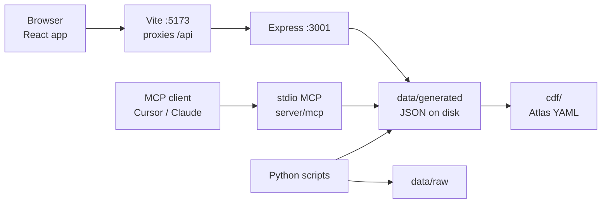
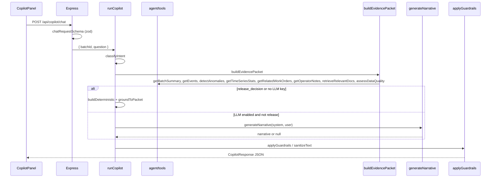

# Architecture

Who should read this: anyone who needs to draw the system on a whiteboard and then follow one question from the browser to disk and back.

## Context

In development, Vite serves the UI from `app/` on port 5173 and proxies `/api` to Express (`vite.config.ts`). Express is created in `server/app.ts` and listened in `server/index.ts` (`PORT`, default 3001). After `npm run build && npm start`, Express also serves `app/dist` and SPA-falls back to `index.html` for non-`/api` paths.

Python owns data: `scripts/generate_synthetic_pharma_data.py` writes `data/raw/`; `scripts/contextualize.py` writes `data/generated/` plus `contextualization_report.json`; `scripts/embed_sops.py` writes `data/generated/sop_embeddings.json`; `scripts/copy-data-to-public.mjs` copies generated JSON (except embeddings) to `public/data/generated/` for the browser. `scripts/export-atlas-agent.ts` reads guardrails + evals + the evidence packet and writes `cdf/`.

The docs site is a **second** Vite app under `site/` with `base: "/PharmaOpsCopilot/"` so GitHub Pages can host it at that path.

## Component inventory

| Area | Responsibility | Must not |
|------|----------------|----------|
| `app/src/adapters` | `IDataProvider`. `LocalDataProvider` fetches `/data/generated/*.json`. `CdfDataProvider.stub.ts` documents SDK calls and throws. | Call Cognite APIs. Import `server/`. |
| `app/src/components` | Dashboard widgets, copilot panel, charts, CDF-ready panels. | Own data fetching except through the provider/context. |
| `app/src/pages` | Routes: `/`, `/copilot`, `/cdf`, `/evals`, `/about`. | Bypass `IDataProvider`. |
| `app/src/hooks` | `useTheme` (`class` on `html`, `localStorage` key `pharmaops-theme`). | Read API keys. |
| `app/src/types` | Shared domain, agent, CDF mapping, report types. Imported by the server so there is one type source. | Depend on React. |
| `app/src/agent` | `askCopilot` / `getHealth` / `runEvalSuite` fetch wrappers. | Hold secrets. |
| `server/agent` | Orchestrator, tools, packet, guardrails, optional LLM, eval runner. | Import `app/src/components`. |
| `server/data` | Load `data/generated` once; throw `DataLoadError` if missing. | Talk to the browser. |
| `server/mcp` | stdio MCP: 12 tools + `pharmaops://agent/guardrails`. Logs to stderr. | Bind a TCP port. |
| `server/retrieval` | Hybrid keyword + TF-IDF; `sectionInScope` batch filter. | Change the packet contract. |
| `scripts/` | Generate, contextualize, embed, copy, sync-check, Atlas export. | Hand-edit outputs under `cdf/` or `data/generated/`. |
| `evals/` | Cases + CLI runner. | Call a live LLM (always `forceDeterministic`). |
| `cdf/` | Toolkit module + CLI agent/eval YAML. | Invent Cognite APIs. |
| `site/` | Marketing/docs landing page. | Duplicate agent logic. |

## Dependency rules

React depends only on `IDataProvider` (`app/src/adapters/IDataProvider.ts`) and `app/src/types`. The server never imports from `app/src/components`. Shared types live in `app/src/types` and are imported by the server so the packet JSON the UI renders is the same shape the orchestrator emits.

`tsconfig.json` sets `baseUrl: "."` and `paths: { "@/*": ["app/src/*"] }`. Vite mirrors that alias in `vite.config.ts`. `include` covers `app/src`, `server`, and `evals`.

## Request lifecycle: "Why was Batch B-104 delayed?"

1. `CopilotPanel` (`app/src/components/CopilotPanel.tsx`) calls `askCopilot` (`app/src/agent/agentClient.ts`).
2. `POST /api/copilot/chat` in `server/app.ts` validates `{ batchId, question }` with zod (`batchId` letters/digits/hyphens, max 32; question max 2000).
3. `runCopilot` (`server/agent/orchestrator.ts`) calls `classifyIntent` (`server/agent/guardrails.ts`).
4. `buildEvidencePacket` (`server/agent/evidenceBuilder.ts`) runs the tools listed above from `server/agent/tools.ts`. Retrieval goes through `retrieveDocuments` (`server/retrieval/simpleRetriever.ts`).
5. Deterministic builders run per intent. If `isLlmEnabled()` and intent is not `release_decision`, `generateNarrative` (`server/agent/llm.ts`) may rewrite prose. Citation ids are filtered to `validIds` from the packet.
6. `groundToPacket` drops bullets that cite foreign ids. `applyGuardrails` / `sanitizeText` neutralize banned phrases.
7. `CopilotResponseView` renders `answer`, `whatHappened`, `contributingFactors`, `whatToCheckNext`, evidence chips, and the human-review disclaimer.

The MCP path shares the same functions: `triage_batch` calls `runCopilot`; `build_evidence_packet` calls `buildEvidencePacket`. Only the transport differs (JSON-RPC stdio vs HTTP).

## Runtime, ports, env

| Variable | Default | Effect |
|----------|---------|--------|
| `PORT` | `3001` | Express listen port (`server/index.ts`). |
| `LLM_PROVIDER` | unset | Force `openai` / `anthropic` / `gemini`. If unset, first key present wins in that order (`getLlmProvider` in `server/agent/llm.ts`). |
| `OPENAI_API_KEY` / `OPENAI_MODEL` | unset / `gpt-4.1-mini` | OpenAI SDK narrative. |
| `ANTHROPIC_API_KEY` / `ANTHROPIC_MODEL` | unset / `claude-sonnet-4-5` | Anthropic Messages API via `fetch`. |
| `GEMINI_API_KEY` / `GEMINI_MODEL` | unset / `gemini-2.5-flash` | Gemini generateContent via `fetch`. |
| `OPENAI_EMBEDDING_MODEL` | unused live | Only if you rebuild `sop_embeddings.json` with `--provider openai`. Live retrieval is TF-IDF. |

Timeout 20s, one retry (`REQUEST_TIMEOUT_MS`, `MAX_RETRIES` in `llm.ts`). No key → deterministic mode. Evals always pass `{ forceDeterministic: true }`.

## Build and deploy

- App: `vite build` from repo root (`root: "app"`), output `app/dist`.
- API in production: `tsx server/index.ts` (no separate `tsc` emit; `tsconfig` is `noEmit`).
- CI (`.github/workflows/ci.yml`): two jobs. `test` runs `generate-data`, requires a clean `git diff` on `data/raw`, `data/generated`, `public/data/generated`, then `check-data-sync`, lint, typecheck, test, eval, `export:atlas` with a clean `git diff` on `cdf/`, then `npm run build`. `site` builds `site/` on Node 20.
- Pages (`.github/workflows/deploy-pages.yml`) rebuilds when `site/**`, the contextualization report, or the workflow file change. Path filters mean a docs-only change under `docs/engineering/` does **not** deploy until T4-2 adds that path.

The site is a separate Vite app because the dashboard is a product UI and the Pages site is a public write-up with a different base path. Mixing them would force `/PharmaOpsCopilot/` onto the local demo.

## Non-goals

From the root README limitations, expanded:

- No live CDF tenant. `CdfDataProvider` stays a stub. There is no `cdf.toml`, so this repo cannot `cdf deploy` by itself.
- No vector database. Retrieval is hybrid keyword + a committed TF-IDF index over a bounded SOP set.
- One fully modeled deviation (B-104). Other batches are thinner on purpose.
- Not a validated GxP application. No batch release, QA disposition, safety, or regulatory decisions.
- No session memory in the HTTP copilot. Atlas `eval.yaml` can be multi-turn; the local runner is single-shot.
