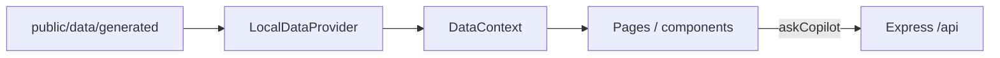

# Frontend

Who should read this: anyone changing a dashboard widget, the copilot panel, or the GitHub Pages landing site.

There are two Vite apps. `app/` is the product UI (proxied to Express). `site/` is the public write-up (`base: "/PharmaOpsCopilot/"`).

## App shell and routing

`app/src/main.tsx`: `ErrorBoundary` → `ThemeProvider` → `ToastProvider` → `BrowserRouter` → `App`. `App.tsx` wraps `DataProvider` + `CopilotProvider` around the header and routes.

| Route | Page | Purpose |
|-------|------|---------|
| `/` | `DashboardPage` | KPIs, asset tree, charts, timeline, copilot column |
| `/copilot` | `CopilotPage` | Full-width chat (`CopilotPanel`) |
| `/cdf` | `DataModelPage` | ISA mapping, contextualization report, CdfReadiness |
| `/evals` | `EvalPage` | Run the 21-case suite via `POST /api/eval/run` |
| `/about` | `AboutPage` | Prototype scope, GxP disclaimer, links |

Header: batch selector (default `B-104`), Demo Mode checkbox, theme toggle, nav underline via Framer `layoutId`. Footer repeats the GxP line.

## Data flow

React depends on `IDataProvider` (`app/src/adapters/IDataProvider.ts`). `LocalDataProvider` fetches `/data/generated/*.json` once in `initialize()`, caches a `DataBundle`, then filters in memory. `CdfDataProvider.stub.ts` implements the same interface and throws `NOT_IMPLEMENTED` — it is documentation of future SDK calls, not a runtime switch.

`DataProvider` (`app/src/context/DataContext.tsx`) calls `initialize()`, then `listAssets` / `listEquipment` / `listBatches` / `getSignals`, plus site/areas JSON. `loading` shows skeletons; `error` is a string. Pages load batch-scoped events, deviations, work orders, notes, documents, anomalies, and time series in `useEffect` when `selectedBatchId` changes.

Copilot: `askCopilot` in `app/src/agent/agentClient.ts` POSTs `{ batchId, question }`. `CopilotContext` is a bus so charts can `ask("Explain the … anomaly")` without owning HTTP. Empty/error: chat shows the API error; charts show a dashed empty card when `points.length === 0`.

## Component map

**Dashboard** (`DashboardPage`): `KpiStrip`, `AssetTree`, `TimeSeriesPanel` or `CombinedSignalChart`, `EventTimeline`, `DeviationSummary`, `EvidencePanel`, `DataQualityPanel`, `CopilotPanel`. Demo Mode currently keeps the canned story visible; batch still drives fetches.

**Copilot** (`CopilotPage` / `CopilotPanel` / `CopilotResponseView`): demo chips from `DEMO_PROMPTS` (`app/src/types/agent.ts`); renders `answer`, `whatHappened`, `contributingFactors`, `whatToCheckNext`, evidence chips, disclaimer. Amber treatment for the GxP warning (`amber-50` / `amber-900`).

**CDF-ready** (`DataModelPage`): `ArchitectureDiagram`, `ContextualizationPanel` (report JSON), `CdfReadinessPanel` (ISA / Records / MCP / Atlas table).

**Evals** (`EvalPage`): fetches suite results; pass/fail per case.

**About** (`AboutPage`): scope and links.

Shared: `BatchSelector`, `ErrorBoundary`, `ui/Skeleton`.

## Charts

Library: **Recharts** (`recharts` LineChart). `TimeSeriesPanel` maps points through `formatTimeOnly` (`en-US`, `hour12: false`). Anomaly windows become `ReferenceArea` (and target `ReferenceLine`) filtered by `signal.id`. Combined view: `CombinedSignalChart`. Empty series: dashed card telling the user B-104 is the modeled demo. Clicking an anomaly calls the copilot bus.

Times are ISO strings stored in plant-local form after contextualization (`PLANT_UTC_OFFSET_HOURS = -5`). Display uses the browser locale for the clock digits only (`formatTimeOnly` / `formatTimestamp` in `app/src/utils/time.ts`).

## Theming

Root `tailwind.config.js`: `darkMode: "class"`. Palettes `brand` (slate-navy 50–900), `accent` (sky 50–800), `status` (alarm/warning/process/quality/operator/maintenance). Fonts Inter + system; `card` / `card-hover` / `glow` shadows.

`useTheme` (`app/src/hooks/useTheme.tsx`): `localStorage` key `pharmaops-theme`; else `prefers-color-scheme`. Toggles `dark` on `document.documentElement`.

Contrast (must hold):

- Light: body `text-slate-700` / `600` on `bg-white`; headings `text-slate-900`.
- Dark: body `text-slate-300` on `brand-800` / `900`; headings `text-slate-100`.
- Links `text-accent-700` / `dark:text-accent-300`.
- GxP warning: `amber-50` / `amber-900` with a border — not yellow-on-white body text.
- Do not use `text-slate-400` as primary body on white.

Framer Motion: route transitions in `AnimatedRoutes`, nav underline, theme icon swap. `app/src/styles.css` sets `prefers-reduced-motion: reduce` to ~zero duration. Charts do not depend on motion.

## Accessibility

Done: theme toggle `aria-label`; nav `aria-label` on the site; chart wrapper `role="img"` + `aria-label` with signal/range; focus outline in CSS; semantic headings; GxP text in the footer.

Not done: full keyboard operability audit, skip-link, live-region for copilot streaming (responses are one-shot JSON), documented WCAG score, screen-reader pass on the asset tree.

## Docs site (`site/`)

Second Vite app so the dashboard is not forced under `/PharmaOpsCopilot/` locally, and so Pages can ship a static write-up with a different information architecture.

`site/src/App.tsx` is a single landing page: Hero, Problem, Value, Gallery, How it works, Agent, Evals, Tech stack, CDF / MCP, Field notes, Getting started. `Nav.tsx` `LINKS` are hash anchors (`#problem` … `#setup`). `CdfReadiness` imports `data/generated/contextualization_report.json` at build time. `FlowDiagram` is the architecture graphic. `CodeBlock` is used for snippets. Theme toggle mirrors the app (`pharmaops-theme` on the site as well — separate `site/src/hooks/useTheme.tsx`).

GitHub Pages: `.github/workflows/deploy-pages.yml` rebuilds on `site/**`, the contextualization report, or the workflow file. Path filters mean markdown under `docs/engineering/` does **not** redeploy the site until the docs-rendering work adds that path.

This file describes the landing site as it exists today. Rendering `docs/engineering/*.md` at `/docs/:slug` is a separate site change.
