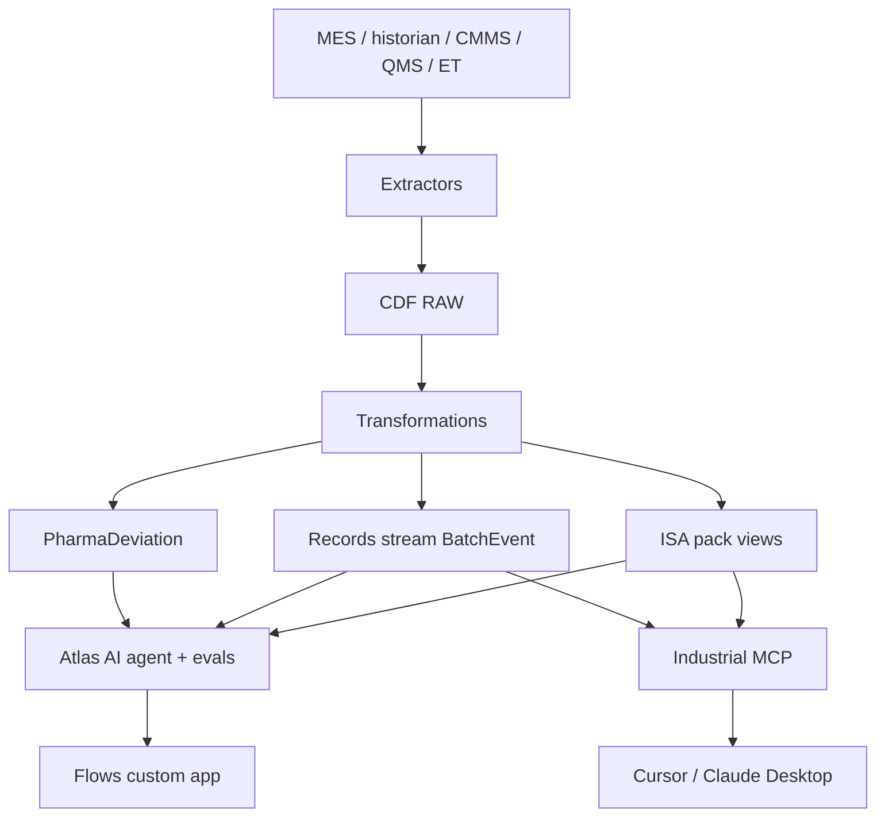

# CDF migration path

Who should read this: someone who has run the local demo and needs an honest sequence to stand up the same pattern on a Cognite Data Fusion project. This repository does not deploy. Mapping detail: [COGNITE_MAPPING.md](../../COGNITE_MAPPING.md).

Effort tags: **S** days, **M** 1–2 weeks, **L** a dedicated workstream. Risks are what usually slips.

## Target architecture

## Step 1 — Deploy the ISA manufacturing pack

Use the [ISA Data Model deployment pack](https://docs.cognite.com/cdf/deploy/cdf_toolkit/references/packages/isa_data_model) (`dp:models:isa_manufacturing_extension`) via Cognite Toolkit. It extends CDM/IDM with ISA-95 hierarchy (Site → Area → ProcessCell → Unit → EquipmentModule) and ISA-88 procedural objects (Recipe → Batch → Phase / Operation).

Local analogue: `site.json`, `areas.json`, `assets.json`, `equipment.json`, `batches.json`.

**Effort:** M including spaces, groups, and a first location. **Risk:** treating the pack as frozen — Cognite documents it as a starting point you extend. Do not duplicate its 26 views in `pharmaops_deviation`.

## Step 2 — Extractors → RAW → transformations

Port `scripts/contextualize.py` function-by-function:

| Local function | CDF stand-in |
|----------------|--------------|
| Read `data/raw/*` | Extractors into RAW tables (MES CSV, historian, CMMS, QMS) |
| `EquipmentResolver` exact/alias/normalized | Transformation SQL + lookup tables; leftover → [entity matching](https://docs.cognite.com/cdf/deploy/cdf_toolkit/references/packages/entity_matching) |
| `fuzzy` (difflib, cutoff 0.8) | Entity matching ML/rules; keep a human review queue — do not auto-link orphans |
| `from_mes_ts` / epoch / `PLANT_UTC_OFFSET_HOURS` | RAW as UTC; transformations emit plant-local or UTC consistently |
| `f_to_c` (271 DEGF points here) | Time series `unit` / `unitExternalId` + datapoint conversion ([units](https://docs.cognite.com/dev/concepts/resource_types/units/units)) |
| Dedupe `EVT-B104-004`, `WO-744` rev 2 | Transformation `QUALIFY ROW_NUMBER()` / business keys |
| Repairs (blank severity, time-only stamp) | Explicit default rules, logged as quality flags |
| `build_signals` instrument-vs-unit | Match historian tag → instrument-index loop, not parent unit |
| `build_events` category from `CLASS` | Map source columns; do not hard-code `"alarm"` |
| `contextualization_report.json` | Quality dashboard / Qualitizer; keep match-method counts |

**Effort:** L (this is the project). **Risk:** cleaning data in the extractor instead of showing RAW dirt; timezone bugs; attaching WFI tags to the bioreactor to make unresolved = 0.

## Step 3 — `PharmaDeviation` + Records stream

Deploy `cdf/modules/pharmaops_deviation/` into a real Toolkit project (`cdf.toml` required).

- Spaces `sp_pharmaops_model`, `sp_pharmaops_records`.
- View `PharmaDeviation` implementing `CogniteDescribable` + `CogniteSourceable`, **not** `CogniteActivity`.
- Container `BatchEvent` with `usedFor: record` and stream `batch_events` (`BasicArchive`) per [Records and streams](https://docs.cognite.com/cdf/dm/records/concepts/records_and_streams).

Wire `PharmaDeviation.batch` / `.equipment` to the **deployed** ISA view versions.

**Effort:** S–M. **Risk:** modeling alarms as graph `CogniteActivity` nodes "for convenience" — that is the failure mode this module exists to avoid.

## Step 4 — Implement `CdfDataProvider`

Replace `LocalDataProvider` in `DataContext`. Sketch from comments in `app/src/adapters/CdfDataProvider.stub.ts`:

| Method | SDK / API |
|--------|-----------|
| `initialize` | `connectToHostApp()` from `@cognite/app-sdk` → `getAccessToken`, `getProject`, `getBaseUrl` → `CogniteClient` ([Auth API](https://docs.cognite.com/cdf/flows/reference/api/auth)) |
| `listAssets` / `getAsset` | Instances list/retrieve ISA-95 / CogniteAsset views |
| `listEquipment` / `getEquipment` | CogniteEquipment filtered by asset relation |
| `listBatches` / `getBatch` | ISA-88 Batch view |
| `getTimeSeries` | Time Series datapoints retrieve by externalId / instanceId ([time series](https://docs.cognite.com/dev/concepts/time_series_index)) |
| `listEvents` | Records query on `BatchEvent` by `batchExternalId` |
| `listWorkOrders` | ISA WorkOrder (or CogniteMaintenanceOrder) |
| `listDocuments` / `searchDocuments` | CogniteFile / ISAFile + search |
| `getRelationships` | Direct relations / edges |
| `getDeviations` | `sp_pharmaops_model:PharmaDeviation` |
| `getAnomalyWindows` | Derived: analytics job or Records; not in the ISA pack |
| `getOperatorNotes` | File/comment or a small extension |
| `getSignals` | ISATimeSeries metadata |

**Effort:** M in a Flows app. **Risk:** calling classic Asset Store APIs for new projects — use data modeling instances. Keep `IDataProvider` so the UI does not fork.

## Step 5 — Atlas agent + CLI evals

`npm run export:atlas` already writes Toolkit + CLI YAML.

1. Place the CLI project under a real `cdf.toml` / agent directory.
2. `npx @cognite/cli@latest auth login`
3. `npx @cognite/cli@latest agents push` then `agents eval --tag ci` ([agents](https://docs.cognite.com/dev/sdks/cognite-cli/agents), [eval](https://docs.cognite.com/dev/sdks/cognite-cli/agents-eval)).
4. Bind tools `query`, `queryTimeSeriesDatapoints`, `askDocument` with an access scope ([agent tools](https://docs.cognite.com/cdf/atlas_ai/references/atlas_ai_agent_tools)).
5. Publish when `--tag ci` is green. Keep `multi-turn` as a slower suite.

**Effort:** S once data exists; M to make faithfulness hold on real packets. **Risk:** editing generated YAML by hand; evals that assert B-104 strings against live plant ids.

## Step 6 — Industrial MCP for desktop copilots

Point Cursor / Claude Desktop at the project's [Industrial MCP](https://docs.cognite.com/cdf/build/industrial_mcp) endpoint. Retire `npm run mcp` for that environment. Local tools `triage_batch` / `build_evidence_packet` become skill-described compositions of `query` + time series + `askDocument`.

**Effort:** S (config). **Risk:** leaving the unauthenticated local stdio server on a shared machine.

## Step 7 — Flows app hosting

Scaffold with `npx @cognite/cli@latest apps create` ([Get started with Flows](https://docs.cognite.com/cdf/flows/guides/getting-started)). Host the React UI in CDF's iframe. Auth via `connectToHostApp()`. Follow [quality guidelines](https://docs.cognite.com/cdf/flows/guides/quality-guidelines) and [Aura](https://docs.cognite.com/cdf/aura/index) if the app is certified. Deploy needs an OAuth client with `apphosting:*` capabilities ([Deploying Flows](https://docs.cognite.com/cdf/flows/guides/deploying)).

**Effort:** M to restyle onto Aura; L if you also need location filters and CSP `manifest.json` for extra origins.

**Risk:** shipping the prototype's open CORS Express API inside CDF — the API should disappear; the browser talks to CDF.

## What you should not do in week one

- Claim the Toolkit skeleton in this repo is a deployed project.
- Fuzzy-match every unmatched tag to the demo unit.
- Let the agent write work orders or close deviations.
- Run LLM-in-the-loop evals as the only gate (keep deterministic / CLI correctness+faithfulness).
- Skip Records because "we only have a few alarms today."
